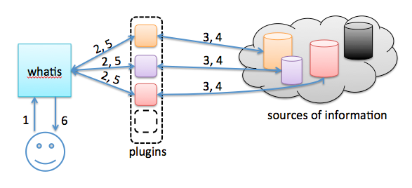

1. Introduction
===============

whatis is a system that collects scattered information about IPs located in distributed sources. Imagine simple and easy way to quickly view all the information you have about the IP you're interested in. Integrate systems like splunk, arbor, shodan, nmap, metasploit and any other databases you can think of. Due to modular approach it is possible to integrate possibly any system. Write your own plugins to get and parse data in any programming language you are comfortable with. 

The project has 2 default plugins at this moment:
* shodan (http://www.shodanhq.com/) - Benefit from extensive shodan database. The plugin requires API key which you can request from shodan website. Additionally, you must install shodan python module.
* raw sqlite - the plugin will perform simple sqlite query of your choice

If you ever had to struggle logging in to all the systems you manage to get info about desired IP, you should definitely take a close look at this project. Leverage the concept of whois protocol and create your own private 'whois' database. 

This project is at the experimental and proof-of-concept phase! The software should be run only in trusted environments. 

2. Architecture
===============



1. submit your query to whatis server. For example, $ whois -h127.0.0.1 shodan:raw:93.184.216.119 whois is standard unix binary. The IP part must be in a format of ```plugin1:plugin2:...:pluginN:IP```
2. whatis parses requests and invokes respective plugins.
3. plugins request data.
4. external source sends the information back to the plugin.
5. plugin parses response and feeds it back to whatis server.
6. whatis collects responses from all invoked plugins and sends them back to the user.

3. Configuration
================

whatis.py - is a main server file, you don't have to change anything here
whatis.conf - Configuration file for server

If you plan to use shodan plugin, edit shodanhq.py file to include API key. Request the key directly from shodan website.  

To add new plugins put them in the plugins directory and edit whatis.conf file. In that file, create new plugin section and register plugin by adding plugin's section name to the [server] plugins variable

4. Example
==========

Let's take an example.com of 93.184.216.119 IP address and request information from 'shodan' and 'owner' plugins. 'owner' plugin is a sqlite database that holds records of owners mapped to the IP addresses. 
With -h whois flag specify the ip address of whatis server. If you changed default TCP/43 port in the conf file, use -p flag to connect to new port. 

```bash
$ whois -h192.168.17.136 owner:shodan:93.184.216.119
OWNER:
(u'Papa Smurf',)
SHODAN:
os: Noneip: u'93.184.216.119'isp: u'EdgeCast Networks'last_update: u'2010-08-28T20:35:18.334000'hostnames: [u'93.184.216.119']location: {u'city': None, u'region_name': None, u'area_code': None, u'longitude': -97.0, u'country_code3': u'USA', u'latitude': 38.0, u'postal_code': None, u'dma_code': None, u'country_code': u'US', u'country_name': u'United States'}timestamp: u'28.08.2010'org: u'EdgeCast Networks'banner: u'HTTP/1.0 404 Not Found\r\nContent-Type: text/html\r\nDate: Sat, 28 Aug 2010 20:35:29 GMT\r\nServer: ECS (dca/5327)\r\nContent-Length: 345\r\n\r\n'port: 80opts: {}
==============================
hostnames: [u'93.184.216.119']title: u'404 - Not Found'ip: u'93.184.216.119'isp: u'EdgeCast Networks'last_update: u'2013-02-25T10:16:44.797363'banner: u'HTTP/1.0 404 Not Found\r\nContent-Type: text/html\r\nDate: Mon, 25 Feb 2013 10:16:44 GMT\r\nServer: ECS (cpm/F845)\r\nContent-Length: 345\r\n\r\n'html: u'<?xml version="1.0" encoding="iso-8859-1"?>\n<!DOCTYPE html PUBLIC "-//W3C//DTD XHTML 1.0 Transitional//EN"\n         "http://www.w3.org/TR/xhtml1/DTD/xhtml1-transitional.dtd">\n<html xmlns="http://www.w3.org/1999/xhtml" xml:lang="en" lang="en">\n\t<head>\n\t\t<title>404 - Not Found</title>\n\t</head>\n\t<body>\n\t\t<h1>404 - Not Found</h1>\n\t</body>\n</html>\n'link: u'Ethernet or modem'location: {u'city': None, u'region_name': None, u'area_code': None, u'longitude': -97.0, u'country_code3': u'USA', u'latitude': 38.0, u'postal_code': None, u'dma_code': None, u'country_code': u'US', u'country_name': u'United States'}timestamp: u'25.02.2013'org: u'EdgeCast Networks'os: u'Linux 3.x'port: 443opts: {}
==============================
(...)
```

5. Credits
==========
I would like to thank Gufo (@_0wl) for valuable discussions we had about the project. 

